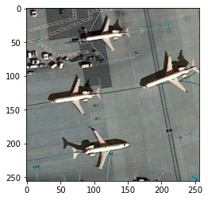

# RCNN Implementation
Computer vision as we know always move around classification and object detection and hence discussing some of the early breakthroughs are pretty sure helpful in understanding modern research. R-CNN was one of the first approach to discuss detection through convolution. Instead of using huge number of proposals R-CNN uses only first 2000 of them, which make it faster than other approches available at that time.

This is a aircraft detection from satellite images dataset with the goal of detecting the aircraft with a bounding box using the RCNN model.
 
 
 
 
 
 
 
 1) First step- Running selective search on indvidual image to obatain region proposals(2000 here).
 2) Second step- Classifying region proposals as positive and negative example based on IOU(IOU explained properly in notebook itself).
 3) Third step- Passing every proposal through pretrained network on some image dataset(We use VGG 16 trained on ImageNet) to output a fixed size feature vector(4096 here).
 4) Fourth step- Using Bounding Box Regression for better results.
 
 __NOTE__: We can increase the accuracy of the model by increasing the epochs or, doing data augmentation or, tuning the hyperparameters, I have not done hyperparameter tuning because the main goal of doing this was not to show accuracy but to understand RCNN and implementing it, you can tune it to get better results.
 
 ### How RCNN works?
 
RCNN bypasses the problem of setting a huge number of regions, and instead __Ross Girshick et al.__ proposed a method where we use selective search to extract just 2000 regions from the image and he called them region proposals.

The CNN acts as a feature extractor and the output dense layer consists of the features extracted from the image and the extracted features are fed into an SVM to classify the presence of the object within that candidate region proposal. In addition to predicting the presence of an object within the region proposals, the algorithm also predicts four values which are offset values to increase the precision of the bounding box. For example, given a region proposal, the algorithm would have predicted the presence of a person but the face of that person within that region proposal could’ve been cut in half

